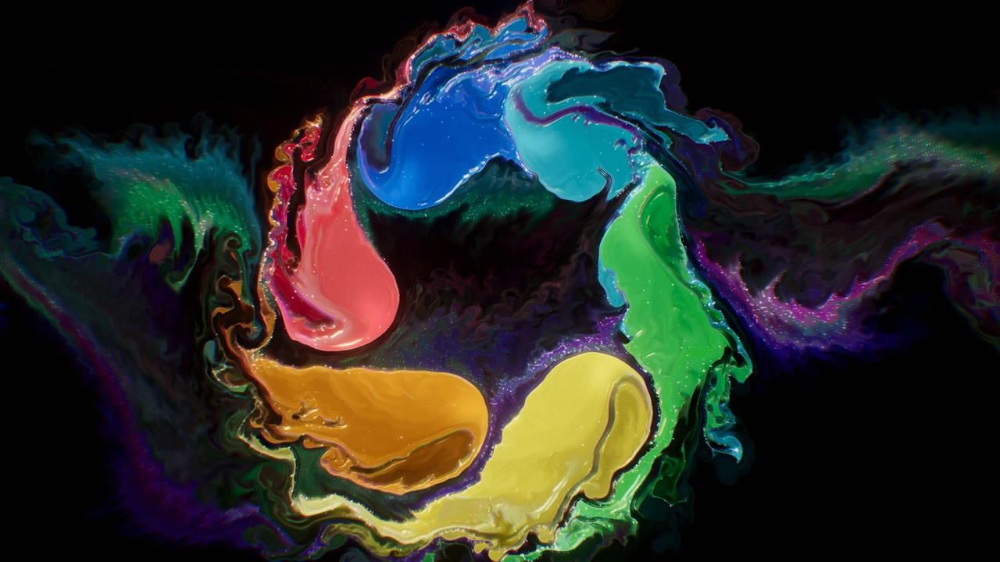

# Chromaflux



Eine Studie in flüssigem Licht: eine echte Fluidsimulation in WebGL2, die
Farben und Formen ineinanderfließen lässt – interaktiv im Browser und als
fertig choreografiertes 1080p-Video mit eigenem Soundtrack.

**Live:** https://hhukkvghj-star.github.io/Chromaflux/ – am Handy in Chrome öffnen, dann funktionieren
auch Vibration und Halte-Modus (beides braucht eine echte https-Seite).

- **`index.html`** – die interaktive Version. Einfach im Browser öffnen,
  keine Installation, keine externen Abhängigkeiten.
- **`render/render.mjs`** – rendert das Video Frame für Frame aus genau
  derselben HTML-Datei (headless Chromium + ffmpeg).

> Enthält Lichtblitze. Bei `prefers-reduced-motion` werden Blitze gedämpft
> und Stroboskop-Effekte weggelassen.

## Start, Ton und Vibration

Die Seite startet nichts von selbst: Ein Startbildschirm zeigt ein Standbild, erst ein Tippen auf
**„Starten · mit Ton"** spielt den 80-Sekunden-Film von Anfang an ab – Ton ist standardmäßig an
(oder „Ohne Ton starten"). Während des Films bleibt der Bildschirm an (Wake Lock, wo erlaubt).

**Vibration** läuft synchron zur Musik: Rumpeln bei Explosionen, ein anschwellender Puls vor jedem
Höhepunkt, kurze Impulse bei den Tintentropfen und feines Ticken beim Rühren.

- **Android** (Chrome, Firefox, Samsung Internet): echte Vibrationsmuster über die Vibration API.
  Funktioniert, wenn die HTML-Datei direkt im Browser geöffnet wird; in eingebetteten Ansichten
  (iFrames, z. B. Vorschaufenster) blockieren Browser die Vibration.
- **iPhone** (iOS 18+): Safari kennt keine Vibration API. Die Seite nutzt deshalb die Haptik eines
  versteckten Schalters – kurze Ticks statt Rumpeln. Ältere iOS-Versionen bleiben stumm.

Der Vibrations-Button erscheint nur, wenn das Gerät Haptik unterstützt.

## Halte-Modus: das Handy als Glas

Mit **„Halten"** (unten rechts, Taste `G`) oder **„Im Halte-Modus starten"** auf dem Startbildschirm
steuerst du die Flüssigkeit nur noch über die Lage des Handys. Der Finger rührt dann nicht mehr,
Antippen blendet nur die Bedienung ein. Beim Aktivieren wird das Glas mit frischer Farbe gefüllt,
die kaum noch verblasst.

- **Neigen:** Die Farbe ist schwerer als das Wasser und fließt bergab zum tiefsten Rand.
  Auf den Kopf gedreht fällt sie in Pilzfingern herunter (Rayleigh-Taylor-Instabilität),
  flach hingelegt schwebt sie fast schwerelos.
- **Schütteln:** Ein kräftiger Ruck zündet eine Farbexplosion mit Blitz, Klang und Vibration.
  Schon leichtes Hin- und Herbewegen lässt die Farbe träge hinterherschwappen.
- **Drehen** in der Bildebene: Die Flüssigkeit bleibt zurück und dreht sich als Strudel gegenläufig.
- **Klang:** Der Gleitton folgt der Neigung, Tonhöhe = Richtung, Lautstärke = Bewegung.
- Eine kleine **Wasserwaage** oben rechts zeigt, wohin die Schwerkraft gerade zieht.
- Kapitel-Knöpfe wechseln im Halte-Modus nur die Farbpalette und füllen das Glas neu.

Technisch kommt alles aus `devicemotion` (Schwerkraft, lineare Beschleunigung, Drehrate), umgerechnet
auf die Bildschirmachsen. Weil in einem randvollen Glas eine gleichmäßige Kraft vom Druck aufgehoben
wird, wirken Neigung und Trägheit auf die Farbdichte – genau das erzeugt das echte Fließverhalten.

**Wo es läuft:** Auf Android in Chrome, wenn die Datei direkt geöffnet ist. Im Claude-Artifact sind
Bewegungssensoren gesperrt. Chrome gibt sie außerdem nur an „sichere" Seiten heraus; kommen keine
Daten an, sagt die Seite nach gut einer Sekunde, woran es liegt. Auf dem iPhone fragt Safari einmal
nach der Erlaubnis für „Bewegung und Ausrichtung" (nur über https). Am Computer simulieren die
Pfeiltasten die Neigung.

## Bedienung

| Eingabe | Wirkung |
| --- | --- |
| Tippen / `Enter` auf dem Startbildschirm | Film mit Ton starten |
| Ziehen (Maus/Finger) | Flüssigkeit umrühren, Farbe einbringen |
| Tippen / Klick | Farbexplosion mit Lichtblitz |
| `Leertaste` | großer Flash in der Bildmitte |
| `1`–`5` | zu einem Kapitel springen |
| `A` | Autopilot (Regie) an/aus – aus = freies Spiel mit der gewählten Palette |
| `M` | Ton an/aus |
| `V` | Vibration an/aus (nur auf Geräten mit Haptik) |
| `G` | Halte-Modus an/aus |
| Pfeiltasten | im Halte-Modus ohne Sensor: Neigung simulieren |
| `F` | Vollbild |
| `H` | Oberfläche ausblenden |
| `P` | Pause |

## Die fünf Kapitel

| # | Palette | Was passiert |
| --- | --- | --- |
| 01 | Neon Iris | Zwei Lichtströme winden sich zur Doppelspirale und kollidieren in einer Explosion |
| 02 | Tinte im Wasser | Weißblende, dann sinken Tintentropfen und blühen zu Pilzwolken auf |
| 03 | Gold & Lava | Ein schwarzer Tropfen schluckt alles, aus der Dunkelheit steigt flüssiges Metall auf und bricht aus |
| 04 | Aurora | Eine Scherschicht rollt sich zu Kelvin-Helmholtz-Wellen auf |
| 05 | Prisma | Sechs Spektralstrahlen spiralen ins Zentrum, Finale mit Dreifach-Blitz |

## Technik in Kürze

- **Solver:** Stable Fluids (Stam) mit Vorticity Confinement, Jacobi-Druckprojektion,
  großskaligem Curl-Noise-Antrieb, Auftrieb und Scherströmung.
- **Farbtransport:** MacCormack-Advektion mit Clamping – feine Filamente bleiben scharf.
- **Shading:** Normalen aus der Farbdichte, Studio-Softboxen im Reflexionsvektor,
  Dünnschicht-Irisieren, metallischer Modus (Gold) und subtraktiver Tinten-Modus auf Weiß.
- **Licht:** HDR-Pipeline mit Bloom (13-Tap-Downsample/Tent-Upsample), radialen
  Lichtstrahlen aus dem Blitzzentrum, anamorphotischen Streaks, chromatischer Aberration,
  ACES-Tonemapping und Filmkorn.
- **Glitzer:** bis zu 147 000 Partikel treiben mit der Strömung und funkeln wie Glimmer.
- **Ton:** WebAudio-Synthese (Pad mit gleitenden Akkorden, FM-Glocken, Riser, Impacts mit
  Sidechain-Ducking, Faltungshall, gläserner Gleitton beim Ziehen). Am Ende der Kette sitzen ein
  Kompressor und ein 4×-oversampelter Soft-Limiter, damit auch wildes Klicken nie übersteuert.
  Live identisch zum Video-Soundtrack, der per `OfflineAudioContext` entsteht.
- **Qualität:** passt sich automatisch an das Gerät an (Eco/Mid/High).

## Video neu rendern

Voraussetzungen: Node 18+, Playwright mit Chromium, ffmpeg.

```bash
# Soundtrack (OfflineAudioContext), danach auf -16 LUFS mastern
node render/render.mjs --mode=audio --out=out/score.wav
ffmpeg -i out/score.wav -af "volume=4.8dB,alimiter=limit=0.85:attack=4:release=80:level=false" \
  -c:a pcm_s24le out/score_master.wav
# Bild: 60 fps, verlustarmer Master in 10-s-Segmenten mit Checkpoints.
# Bricht der Lauf ab, einfach denselben Befehl erneut starten – er setzt bit-genau fort.
node render/render.mjs --mode=raw --w=1920 --h=1080 --fps=60 --chunk=600 \
  --preset=veryfast --crf=12 --out=out/master.mp4
# Auslieferung (2-Pass H.264 + AAC)
ffmpeg -i out/master.mp4 -c:v libx264 -preset slow -b:v 4600k -pass 1 -an -f null /dev/null
ffmpeg -i out/master.mp4 -i out/score_master.wav -map 0:v -map 1:a -c:v libx264 -preset slow \
  -b:v 4600k -pass 2 -pix_fmt yuv420p -c:a aac -b:a 192k -movflags +faststart chromaflux-1080p60.mp4
```

In SwiftShader (CPU) dauert ein 1080p-Frame gut eine Sekunde, das ganze Video also rund 90 Minuten.
`--mode=audio --raw=1` liefert den Mix ungemastert als 32-Bit-Float – praktisch, um Pegel und Klicks zu prüfen.

Vorschau-Standbilder eines Abschnitts: `--mode=png --w=960 --h=540 --every=60 --start=24.6 --to=40`.

Schriften (eingebettet, SIL Open Font License): Syncopate, IBM Plex Mono.
